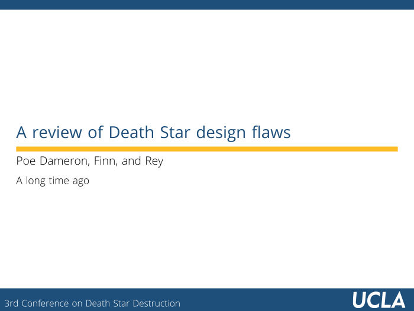
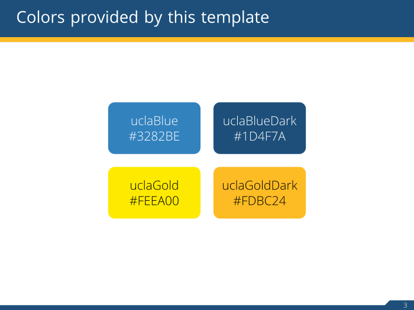

# beamer-UCLA :: An unofficial UCLA beamer theme

## Requirements:
* Lualatex or xelatex - The template utilizes the `fontspec` package, which requires lualatex or xelatex. They should have been installed with Latex.
* Open Sans Font - The provided example use the Open Sans Font. The font can be downloaded from https://fonts.google.com/.

## Installation:
The installation directory depends on OS. Clone the repository into one of the following locations.

* Windows : `C:\Users\<user name>\texmf\tex\latex\local\beamer-UCLA\`
* Mac OS X : `/Users/<user name>/Library/texmf/tex/latex/local/beamer-UCLA/`
* Linux : `~/texmf/tex/latex/local/beamer-UCLA/`

Once cloned, try compiling the provided example.
